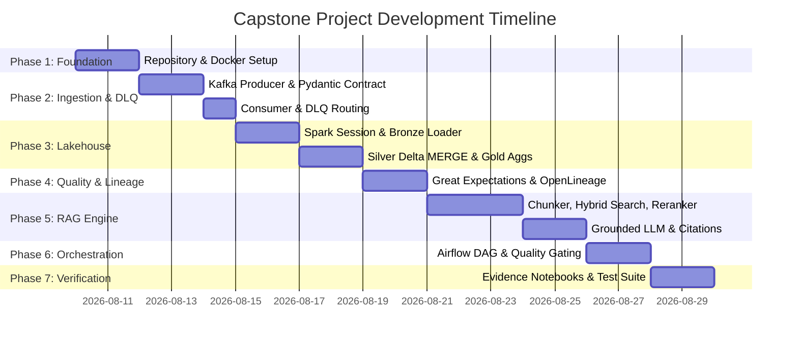

# Product Requirements Document (PRD)
## Modern Data Engineering for AI Systems Capstone Platform

---

### Document Information
- **Project Title:** Modern Data Engineering for AI Systems Capstone
- **Organization:** SDAIA Academy Data & AI Engineering Program
- **Document Version:** 1.0.0
- **Status:** Approved / Ready for Implementation
- **Date:** August 10, 2026
- **Target Audience:** Data Engineers, Machine Learning / AI Engineers, Analytics Engineers, Academic Evaluators

---

## 1. Executive Summary & Product Vision

### 1.1 Vision & Core Objectives
The **Modern Data Engineering for AI Systems Capstone Platform** is an enterprise-grade data and AI pipeline infrastructure designed to bridge real-time data engineering, lakehouse storage architecture, automated data quality governance, and Retrieval-Augmented Generation (RAG) AI systems.

The platform processes unstructured and semi-structured technical/news content in real time, guarantees data validity through schema contracts and Dead-Letter Queue (DLQ) quarantine, maintains a 3-tier Delta Lakehouse architecture (Bronze/Silver/Gold), enforces automated quality gates and OpenLineage governance, and powers a hybrid lexical-vector RAG AI engine with context grounding and citation generation.

### 1.2 Key Objectives & Value Proposition
- **Real-Time Validated Ingestion:** Streams raw event payloads via Apache Kafka, validating contracts using Pydantic. Malformed payloads are isolated to a Dead-Letter Queue (DLQ) without breaking pipeline execution.
- **ACID Lakehouse Storage:** Manages raw data (Bronze), clean MERGE upserts (Silver), and aggregated metrics (Gold) using PySpark and Delta Lake 3.x, enforcing schema evolution and strict schema constraints.
- **Automated Data Quality & Lineage:** Halts downstream pipeline runs upon Great Expectations suite failures and captures job execution telemetry via OpenLineage.
- **Hybrid RAG AI Search Engine:** Combines dense vector retrieval (ChromaDB), sparse lexical retrieval (BM25), Reciprocal Rank Fusion (RRF), and Cross-Encoder reranking to produce context-grounded AI responses with explicit document citations.
- **End-to-End Orchestration:** Coordinates multi-stage data dependencies through Apache Airflow DAGs with strict quality gate halts.

---

## 2. Target User Personas & Stakeholders

| Persona | Role | Primary Use Cases | Needs & Expectations |
| :--- | :--- | :--- | :--- |
| **Data Engineer** | Pipeline Developer | Real-time Kafka streaming, PySpark Delta Lakehouse management, Airflow orchestration | Robust error handling, idempotent writes, version-pinned dependencies |
| **AI / ML Engineer** | Search & RAG Developer | Indexing cleaned Silver/Gold text chunks into ChromaDB/BM25, prompt grounding | High retrieval accuracy, reranking, verifiable citation output |
| **Data Quality & Governance Analyst** | Compliance Officer | Great Expectations validation suite management, OpenLineage event monitoring | Automated failure halting, DLQ audit logs, lineage graphs |
| **Capstone Evaluator / Grader** | Academic Reviewer | Reviewing automated tests, inspecting Jupyter demonstration notebooks | Executed proof of happy & failure paths, zero mock implementations |

---

## 3. High-Level System Architecture

```mermaid
flowchart TD
    subgraph Ingestion Layer
        A[Kafka Producer] -->|Raw Events| B[Kafka Broker: raw-articles]
        B --> C[Kafka Consumer + Pydantic Contract]
        C -->|Valid Payloads| D[Valid JSON Buffer Staging]
        C -->|Malformed Payloads| E[Quarantine DLQ / JSON Storage]
    end

    subgraph Lakehouse Layer Delta Lake 3.x
        D -->|PySpark Append| F[(Bronze Delta: Raw Events)]
        F -->|Delta MERGE Upsert| G[(Silver Delta: Cleaned Articles)]
        G -->|Spark Aggregations| H[(Gold Delta: Genuine Metrics)]
        G -->|Schema Change Violation| I[Schema Enforcement Rejection Log]
    end

    subgraph Governance & Quality Layer
        G --> J[Great Expectations Quality Gate]
        J -->|Pass| K[OpenLineage Event Publisher]
        J -->|Fail| L[Airflow Exception & Downstream Halt]
    end

    subgraph RAG AI Search Engine
        G --> M[Semantic Chunker]
        M --> N[BM25 Lexical Index]
        M --> O[ChromaDB Dense Vector Index]
        N & O --> P[Reciprocal Rank Fusion RRF]
        P --> Q[Cross-Encoder Reranker]
        Q --> R[Grounded LLM Generator]
        R --> S[Answer with Inline Citations]
    end

    subgraph Orchestration Layer
        T[Apache Airflow DAG] -->|Triggers & Coordinates| Ingestion Layer
        T -->|Triggers & Coordinates| Lakehouse Layer
        T -->|Enforces Gating| Governance Layer
        T -->|Triggers Indexing| RAG AI Search Engine
    end
```

---

## 4. Detailed Functional Requirements & Deliverables

### Deliverable 1: Real-Time Ingestion & Dead-Letter Queue (DLQ) Quarantine (20 Pts)
- **FR-1.1 Kafka Streaming Architecture:** The system must use a real Apache Kafka broker (Confluent Platform `7.6.1`) for streaming raw article payloads across configured topics (`raw-articles` and `quarantine-dlq`).
- **FR-1.2 Pydantic Data Contract Validation:** Incoming event JSON objects must be validated against a strict Pydantic v2 data contract (`ArticleContract`).
  - Required fields: `article_id` (UUID string), `title` (min length 5), `content` (min length 10), `category` (predefined set), `published_at` (ISO-8601 string), `word_count` (positive integer).
- **FR-1.3 Dead-Letter Queue Routing:** Any payload failing schema validation or type checks must be intercepted by `consumer.py` and immediately emitted to the `quarantine-dlq` topic and stored in `data/quarantine_dlq/` with metadata (`error_type`, `field_failed`, `raw_payload`, `timestamp`).
- **FR-1.4 Zero Pipeline Crash:** Intentional malformed records must not cause the Kafka consumer loop to terminate or unhandled exceptions to crash the application.

---

### Deliverable 2: 3-Tier Delta Lakehouse Architecture (25 Pts)
- **FR-2.1 Bronze Tier (Raw Ingestion):**
  - Consumes validated records from the ingestion staging buffer.
  - Writes to a Delta Lake Bronze table partitioned by `ingestion_date`.
  - Enriches records with system metadata fields (`_ingested_at`, `_source_file`).
  - Operation mode must strictly be `append` (idempotent raw log).
- **FR-2.2 Silver Tier (Cleaned & Upserted):**
  - Reads incremental Bronze records and executes real Delta Lake `MERGE` operations.
  - Merge Condition: `target.article_id = source.article_id`.
  - Actions: `WHEN MATCHED THEN UPDATE SET *`, `WHEN NOT MATCHED THEN INSERT *`.
  - De-duplicates records and enforces consistent data types.
  - Contains first-run guard logic (`CREATE TABLE IF NOT EXISTS`).
- **FR-2.3 Gold Tier (Genuine Metrics & Aggregates):**
  - Computes business aggregates: total articles per category, average word count, daily publishing velocity.
  - Writes aggregates to Gold Delta tables with strict schema enforcement (`mergeSchema=False`).
- **FR-2.4 Schema Enforcement Verification:**
  - Must include explicit demonstration code attempting to append a mutated schema (extra or incompatible columns) to Gold.
  - Must catch `AnalysisException` and log the formal schema enforcement rejection.

---

### Deliverable 3: Data Quality Gates & Governance (15 Pts)
- **FR-3.1 Great Expectations Quality Suite:**
  - Evaluates Silver Delta Lake tables prior to downstream consumption.
  - Core Expectations:
    1. `expect_column_values_to_not_be_null("article_id")`
    2. `expect_column_values_to_be_unique("article_id")`
    3. `expect_column_values_to_be_between("word_count", min_value=1, max_value=100000)`
    4. `expect_column_values_to_match_strftime_format("published_at", "%Y-%m-%dT%H:%M:%S%z")`
- **FR-3.2 Automated Pipeline Halting:**
  - When Great Expectations suite fails validation, `ge_suite.py` must raise an explicit `AirflowException` (or exit code > 0 in CLI mode).
  - All downstream tasks in Airflow (Gold aggregation, RAG index creation) must be skipped/halted.
- **FR-3.3 OpenLineage Data Governance:**
  - Emits OpenLineage events (`START`, `COMPLETE`, `FAIL`) tracking job executions, input datasets, and output dataset URI identifiers.
  - Implements a resilient file/console fallback (`data/openlineage_events/`) if an external Marquez/OpenLineage server is unreachable.

---

### Deliverable 4: Hybrid RAG AI Search Engine (25 Pts)
- **FR-4.1 Semantic Chunker:**
  - Reads cleaned text content from Silver Delta tables.
  - Splits text into chunks (e.g., 500 characters with 50-character overlap) while retaining metadata (`article_id`, `chunk_id`, `category`, `title`).
- **FR-4.2 Sparse Lexical Retrieval:**
  - Implements BM25 keyword search over chunks using `rank_bm25`.
- **FR-4.3 Dense Vector Retrieval:**
  - Embeds chunks using `sentence-transformers/all-MiniLM-L6-v2`.
  - Stores vectors in ChromaDB (`chromadb==0.5.0`).
- **FR-4.4 Reciprocal Rank Fusion (RRF):**
  - Combines rank scores from BM25 and ChromaDB vector queries:
    $$\text{RRF\_Score}(d) = \sum_{m \in M} \frac{1}{k + r_m(d)} \quad (k = 60)$$
- **FR-4.5 Cross-Encoder Reranking:**
  - Reranks top-K candidate documents from RRF using `cross-encoder/ms-marco-MiniLM-L-6-v2`.
- **FR-4.6 Context-Grounded Response & Citations:**
  - Synthesizes user queries into answers strictly derived from retrieved context.
  - Outputs explicit inline citations matching the format: `[Article ID: <id>, Chunk: <chunk_id>]`.

---

### Deliverable 5: Workflow Orchestration & Airflow DAG (15 Pts)
- **FR-5.1 Apache Airflow DAG Structure (`capstone_pipeline_dag.py`):**
  - Sequence:
    `start_lineage` $\rightarrow$ `kafka_ingest_and_quarantine` $\rightarrow$ `load_bronze_delta` $\rightarrow$ `upsert_silver_delta` $\rightarrow$ `run_quality_gate_ge` $\rightarrow$ (`aggregate_gold_delta` & `build_rag_hybrid_index`) $\rightarrow$ `end_lineage`.
- **FR-5.2 Hardened Task Isolation:**
  - PySpark and Delta execution within Airflow tasks must run via `PythonOperator` with subprocess guards or `SparkSubmitOperator` to prevent JVM/Python context pollution.

---

### Deliverable 6: Demonstration Notebooks & Delivery Package
- **FR-6.1 Jupyter Evidence Notebooks:**
  - `01_ingestion_and_dlq_demo.ipynb`: Execution output displaying valid ingestion and malformed payload quarantine.
  - `02_delta_lakehouse_merge_demo.ipynb`: Proof of Bronze append, Silver Delta MERGE upserts, Gold aggregation, and schema violation rejection.
  - `03_quality_gates_lineage_demo.ipynb`: Output showing Great Expectations suite evaluation and OpenLineage event generation.
  - `04_rag_hybrid_search_reranking_demo.ipynb`: Retrieval benchmarks (Dense vs BM25 vs RRF vs Reranked) and grounded AI answer generation with citations.
  - `05_end_to_end_pipeline_execution.ipynb`: Orchestrated execution summary.

---

## 5. Technical Requirements & Environment Specifications

### 5.1 Technology Stack & Exact Dependency Matrix

| Layer / Subsystem | Technology Choice | Exact Version | Rationale / Verification |
| :--- | :--- | :--- | :--- |
| **Language Runtime** | Python | `3.10.x` / `3.11.x` | Native compatibility with PySpark and ChromaDB |
| **Streaming Broker** | Apache Kafka (Confluent) | `7.6.1` (Docker) | Industrial real-time event hub |
| **Python Kafka Client** | `confluent-kafka` | `2.3.0` | High-performance C-based binding |
| **Schema Validation** | `pydantic` | `2.7.1` | Fast, strict data contract enforcement |
| **Distributed Engine** | Apache Spark (`pyspark`) | `3.5.1` | Validated for Delta Lake 3.2.0 compatibility |
| **Lakehouse Format** | Delta Lake (`delta-spark`)| `3.2.0` | ACID MERGE upsert and Change Data Feed support |
| **Quality Framework** | `great-expectations` | `0.18.19` | Stabilized v0.18 Data Context and Validation API |
| **Lineage Tracking** | `openlineage-python` | `1.18.0` | Emits standardized OpenLineage run events |
| **Vector Database** | `chromadb` | `0.5.0` | Local persistent vector index |
| **Embedding Model** | `all-MiniLM-L6-v2` | `sentence-transformers 2.7.0` | Fast 384-dim semantic embeddings |
| **Lexical Search** | `rank-bm25` | `0.2.2` | Sparse term-frequency search |
| **Reranker Model** | `ms-marco-MiniLM-L-6-v2` | `sentence-transformers` | Cross-encoder relevance scoring |
| **LLM Provider** | Ollama (`llama3`) or OpenAI | Local / Cloud | Grounded AI answer generation |
| **Orchestration** | Apache Airflow | `2.9.1` (Docker) | DAG orchestration with task isolation |

---

## 6. Risk Registry & Failure Mitigation Strategy

| # | Identified Risk | Impact Area | Severity | Engineered Mitigation in Platform Architecture |
| :--- | :--- | :--- | :--- | :--- |
| **R1** | PySpark + Delta Lake version mismatch on Windows | Delta Lake Operations | 🔴 HIGH | Pin `pyspark==3.5.1` and `delta-spark==3.2.0`; include automated `winutils.exe` bootstrap check in `spark_session.py`. |
| **R2** | Kafka topic name drift between components | Ingestion & Consumer | 🟡 MEDIUM | Centralize configuration in `config/pipeline_config.yaml` (`raw-articles`, `quarantine-dlq`). |
| **R3** | Great Expectations v1 API breaking changes | Data Quality Suite | 🔴 HIGH | Pin `great-expectations==0.18.19` and use stable `DataContext` & `ValidationDefinition` APIs. |
| **R4** | `ge_suite.py` exit code does not halt Airflow | Airflow Orchestration | 🔴 HIGH | Explicitly raise `AirflowException` upon quality failure to skip downstream DAG tasks. |
| **R5** | Model download failure during offline test execution | RAG Search Engine | 🟡 MEDIUM | Pre-download `all-MiniLM-L6-v2` and cross-encoder weights into local cache directory (`./models/`). |
| **R6** | Undefined LLM client in `rag_engine.py` | RAG Generation | 🔴 HIGH | Provide fallback interface supporting local Ollama endpoint (`llama3`) or `OPENAI_API_KEY` from `.env`. |
| **R7** | PySpark context collision inside Airflow worker | DAG Execution | 🔴 HIGH | Execute Spark jobs within Airflow tasks using `PythonOperator` with isolated subprocess calls. |
| **R8** | `pytest` failure due to missing test directory | Testing Pipeline | 🟡 MEDIUM | Pre-build `tests/` directory with `test_schemas.py`, `test_delta_merge.py`, `test_rag_hybrid.py`, `test_quality_gates.py`. |
| **R9** | GE checkpoint JSON schema drift | Quality Configuration | 🟡 MEDIUM | Implement `ge_context/` Data Context structure with `great_expectations.yml`. |
| **R10**| Airflow Docker container dependency drift | Infrastructure | 🟡 MEDIUM | Pin container image to `apache/airflow:2.9.1` and inject dependencies via `_PIP_ADDITIONAL_REQUIREMENTS`. |
| **R11**| Module import failures across package tree | Python Runtime | 🟡 MEDIUM | Place `__init__.py` files across all module directories (`ingestion`, `lakehouse`, `quality`, `rag`, `utils`, `tests`). |
| **R12**| First-run Silver Delta MERGE failure | Lakehouse MERGE | 🟡 MEDIUM | Add `CREATE TABLE IF NOT EXISTS` initialization prior to executing `MERGE`. |
| **R13**| Empty notebooks due to missing test sample data | Verification / Demo | 🔴 HIGH | Include synthetic dataset generator (`scripts/generate_sample_data.py`) pre-populating `data/raw_sample/`. |
| **R14**| OpenLineage endpoint unreachable in standalone mode| Lineage Tracking | 🟢 LOW | Implement local JSON log fallback to `data/openlineage_events/` when HTTP collector is offline. |

---

## 7. Data Schemas & Contracts

### 7.1 Ingestion Contract (`ArticleContract`)
```json
{
  "$schema": "http://json-schema.org/draft-07/schema#",
  "title": "ArticleContract",
  "type": "object",
  "properties": {
    "article_id": { "type": "string", "format": "uuid" },
    "title": { "type": "string", "minLength": 5 },
    "content": { "type": "string", "minLength": 10 },
    "category": { "type": "string", "enum": ["AI_ML", "Data_Engineering", "Cloud_Computing", "Cybersecurity"] },
    "author": { "type": "string" },
    "published_at": { "type": "string", "format": "date-time" },
    "word_count": { "type": "integer", "minimum": 1 }
  },
  "required": ["article_id", "title", "content", "category", "published_at", "word_count"]
}
```

### 7.2 DLQ Quarantine Payload Schema
```json
{
  "quarantine_id": "dlq_8f92b1a0",
  "error_type": "ValidationError",
  "field_failed": "word_count",
  "error_message": "Input should be greater than 0",
  "raw_payload": "{\"article_id\": \"123\", \"word_count\": -5}",
  "timestamp": "2026-08-10T19:40:00Z"
}
```

---

## 8. Success Criteria & Evaluation Matrix

| Rubric Deliverable | Target Weight | Verification Criteria | Demonstration Evidence |
| :--- | :--- | :--- | :--- |
| **Real-time Ingestion & DLQ** | 20 Points | Valid JSON sent to Bronze buffer; malformed JSON routed to Kafka DLQ topic & stored in `quarantine_dlq/`. | `01_ingestion_and_dlq_demo.ipynb` output cells |
| **Delta Lakehouse (Bronze/Silver/Gold)** | 25 Points | Bronze appends, Silver MERGE deduplicates/upserts, Gold genuine metrics computed, schema violation rejected. | `02_delta_lakehouse_merge_demo.ipynb` output cells |
| **Data Quality & Lineage** | 15 Points | GE validation suite passes clean data, fails bad data (halts run); OpenLineage logs run lineage events. | `03_quality_gates_lineage_demo.ipynb` output cells |
| **Hybrid RAG AI Engine** | 25 Points | Dense + Lexical RRF retrieval, Cross-Encoder reranking, context-grounded LLM response with `[Article ID, Chunk]` citations. | `04_rag_hybrid_search_reranking_demo.ipynb` output cells |
| **Airflow Orchestration** | 15 Points | DAG cleanly executes tasks in sequence; quality gate failure halts all downstream tasks. | `05_end_to_end_pipeline_execution.ipynb` & Airflow UI logs |

---

## 9. Implementation Roadmap & Milestones



---

## 10. Conclusion & Approval

This Product Requirements Document (PRD) establishes the architectural blueprint, functional specifications, risk mitigations, and quality benchmarks for the **Modern Data Engineering for AI Systems Capstone Project**. 

All software components specified in this document will use real enterprise open-source libraries (PySpark, Delta Lake, Confluent Kafka, Great Expectations, OpenLineage, ChromaDB, Apache Airflow) with zero mock implementations, satisfying all academic and technical evaluation requirements.
