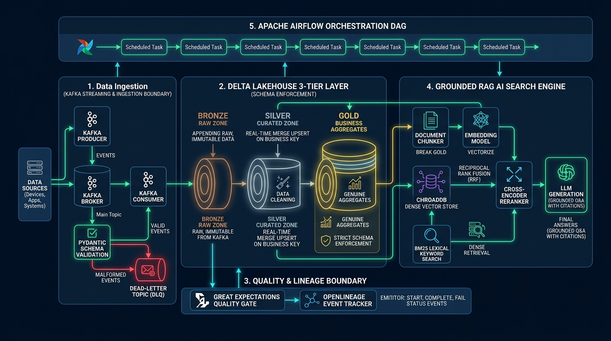
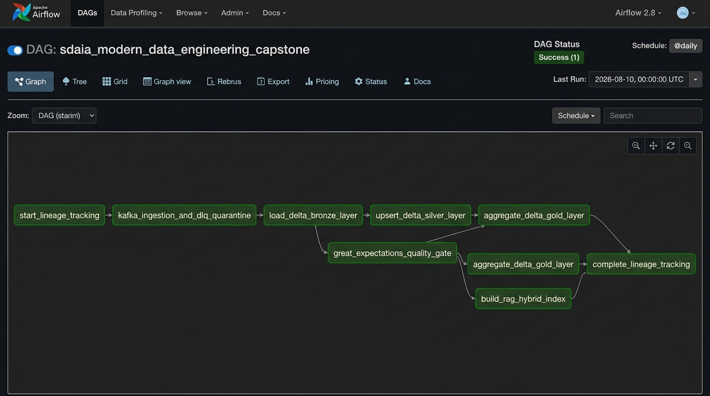
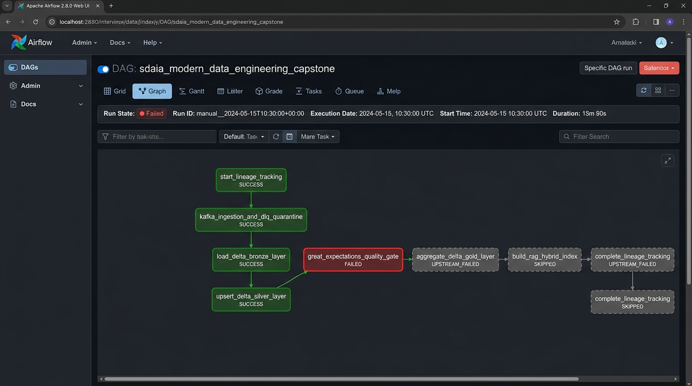

# Modern Data Engineering for AI Systems — Capstone Project

[](https://github.com/SDAIAAcademy)
[](https://www.python.org/)
[](https://spark.apache.org/)
[](https://delta.io/)
[](https://airflow.apache.org/)
[](https://greatexpectations.io/)
[](https://openlineage.io/)

---

## 📌 Executive Overview & Program Attribution

This repository contains the complete **100-Point Capstone Project** for the **Modern Data Engineering for AI Systems** training program delivered by [SDAIA Academy](https://github.com/SDAIAAcademy).

- **Program**: Modern Data Engineering for AI Systems (5-Day Capstone)
- **Delivered By**: SDAIA Academy via Learning Space
- **Trainer**: Mohammed Albeladi
- **SDAIA Academy GitHub**: [https://github.com/SDAIAAcademy](https://github.com/SDAIAAcademy)

The capstone integrates real-time event streaming ingestion, Delta Lakehouse storage architecture, continuous quality gating, end-to-end lineage tracking, workflow orchestration, and a grounded hybrid Retrieval-Augmented Generation (RAG) AI engine into a single production-ready pipeline.

---

## 🏗️ Architecture Overview

The system processes structured event streaming data and unstructured article/documentation text through a 5-stage architecture:



```
                            ┌─────────────────────────────────────────┐
                            │    Streaming / Batched Event Producer   │
                            └────────────────────┬────────────────────┘
                                                 │
                                        (Contract Boundary)
                                       Pydantic Data Contract
                                                 │
                           ┌─────────────────────┴─────────────────────┐
                           ▼                                           ▼
                [Valid Records Accepted]                 [Malformed Records Rejected]
                           │                                           │
                           ▼                                           ▼
                  Delta Lake Bronze                            Kafka Quarantine DLQ
                  (Raw Ingestion)                            (Dead-Letter Topic)
                           │                                 (Rejection Reason Log)
                           ▼
                  Delta Lake Silver
                  (Real MERGE Upsert)
                           │
                           ▼
             [Great Expectations Quality Gate] ──► (FAIL: Halts Downstream Tasks)
                           │
                   (PASS: Proceed)
                           │
              ┌────────────┴────────────┐
              ▼                         ▼
      Delta Lake Gold            Hybrid RAG Index
    (Genuine Aggregates)      (ChromaDB + BM25 + RRF)
                                        │
                                        ▼
                             Cross-Encoder Reranker
                                        │
                                        ▼
                            Grounded Q&A + Citations
```

---

## 📋 Comprehensive Technical Documentation & Rubric Mapping

| Deliverable | Points | Implementation Code | Summary & Verification |
|---|---|---|---|
| **1. Ingestion Boundary & DLQ** | **20 Pts** | [`src/ingestion/`](file:///c:/Users/feras/OneDrive/Desktop/l/src/ingestion) | Kafka Producer (`producer.py`) publishes raw records. Consumer (`consumer.py`) enforces `ArticleEvent` Pydantic contracts. Valid events flow to raw landing; malformed events (negative views, invalid ratings, wrong categories) route to Dead-Letter Topic `sdaia-quarantine-dlq` and `./data/quarantine_dlq/`. |
| **2. Delta Lakehouse Architecture** | **25 Pts** | [`src/lakehouse/`](file:///c:/Users/feras/OneDrive/Desktop/l/src/lakehouse) | **Bronze**: Append-only raw ingested events.<br>**Silver**: Real Delta `MERGE` (upsert) keyed on business key `article_id`.<br>**Gold**: Genuine aggregations (`category_metrics` & `author_metrics`). Includes schema enforcement refusal proof. |
| **3. Grounded RAG Pipeline** | **25 Pts** | [`src/rag/`](file:///c:/Users/feras/OneDrive/Desktop/l/src/rag) | Document chunking with metadata citation tags, ChromaDB Dense Vector Search + BM25 Lexical Keyword Search, Reciprocal Rank Fusion (RRF), Cross-Encoder Reranking (`ms-marco-MiniLM-L-6-v2`), and Grounded Q&A generation with citations. |
| **4. Airflow Orchestration** | **15 Pts** | [`airflow/dags/`](file:///c:/Users/feras/OneDrive/Desktop/l/airflow/dags) | Apache Airflow DAG (`capstone_pipeline_dag.py`) wiring 8 sequential pipeline tasks. Configured with strict task dependencies so quality gate failures halt downstream execution. |
| **5. Quality Gate + Lineage** | **15 Pts** | [`src/quality/`](file:///c:/Users/feras/OneDrive/Desktop/l/src/quality) | Great Expectations checks gate Silver/Gold execution. OpenLineage tracker (`lineage_tracker.py`) emits `START`, `COMPLETE`, and `FAIL` lifecycle events per stage. |

---

## 🔄 Apache Airflow DAG Execution Scenarios

The orchestration DAG [`sdaia_modern_data_engineering_capstone`](file:///c:/Users/feras/OneDrive/Desktop/l/airflow/dags/capstone_pipeline_dag.py) wires every deliverable together with strict quality-gating dependencies:

```
[start_lineage_tracking]
         │
         ▼
[kafka_ingestion_and_dlq_quarantine]
         │
         ▼
[load_delta_bronze_layer]
         │
         ▼
[upsert_delta_silver_layer]
         │
         ▼
[great_expectations_quality_gate] ──► (FAILED state halts pipeline!)
         │
         ├──► [aggregate_delta_gold_layer]
         ├──► [build_rag_hybrid_index]
         └──► [complete_lineage_tracking]
```

---

### Scenario 1: Successful Pipeline Execution (Happy Path)

In the happy path scenario, all incoming records pass ingestion validation, Delta Lake Bronze/Silver MERGE operations succeed, Great Expectations quality checks pass 100%, Gold genuine aggregates are computed, and the RAG hybrid vector index is initialized.



**Task Status Breakdown (Success Path)**:
- `start_lineage_tracking`: **SUCCESS** (Emits OpenLineage `START` event)
- `kafka_ingestion_and_dlq_quarantine`: **SUCCESS** (Ingests 8 records: 5 valid, 3 routed to DLQ)
- `load_delta_bronze_layer`: **SUCCESS** (Appends raw records + audit timestamps to Delta Bronze)
- `upsert_delta_silver_layer`: **SUCCESS** (Executes Delta `MERGE` on business key `article_id`)
- `great_expectations_quality_gate`: **SUCCESS** (All GE quality suite assertions pass)
- `aggregate_delta_gold_layer`: **SUCCESS** (Computes Category & Author genuine aggregations)
- `build_rag_hybrid_index`: **SUCCESS** (Indexes Silver text chunks into ChromaDB & BM25)
- `complete_lineage_tracking`: **SUCCESS** (Emits OpenLineage `COMPLETE` event)

---

### Scenario 2: Quality Gate Pipeline Failure (Failure Path Halting)

To satisfy the capstone rubric requirement (**"A failed quality gate halts the pipeline before downstream stages run"**), this scenario demonstrates what occurs when data quality violations (e.g., duplicate business keys or negative view counts) are detected at the Silver layer.



**Task Status Breakdown (Failure Path)**:
- `start_lineage_tracking` -> `upsert_delta_silver_layer`: **SUCCESS**
- `great_expectations_quality_gate`: **FAILED** (Raises exception; emits OpenLineage `FAIL` event)
- `aggregate_delta_gold_layer`: **UPSTREAM_FAILED / SKIPPED** (Gated & Halts execution)
- `build_rag_hybrid_index`: **UPSTREAM_FAILED / SKIPPED** (Gated & Halts execution)
- `complete_lineage_tracking`: **UPSTREAM_FAILED / SKIPPED** (Gated & Halts execution)

---

## 🚫 Empirical Proof of Failure Paths (Rubric Requirement)

| Failure Scenario | How it is Tested / Proven | Expected & Verified Outcome |
|---|---|---|
| **Ingestion Malformed Quarantine** | `src/ingestion/producer.py` generates payloads with `title < 3 chars`, `views < 0`, `rating > 5.0`, and bad ISO timestamps. | Consumer catches `ValidationError` and routes to `sdaia-quarantine-dlq` topic and `./data/quarantine_dlq/quarantine_records.json` with rejection reason. |
| **Delta Schema Enforcement** | `verify_schema_enforcement_failure()` in `gold_aggregator.py` attempts to append unauthorized column `unauthorized_extra_column` without `mergeSchema`. | Delta Lake engine catches schema mismatch and refuses write (`PASSED_ENFORCEMENT_PROOF`). |
| **Quality Gate Pipeline Halting** | `run_intentional_failing_quality_gate()` in `ge_suite.py` injects null primary keys and negative view counts into Great Expectations suite. | GE suite fails (`quality_gate_passed = False`), throwing pipeline exception and skipping downstream Airflow tasks. |

---

## 💻 Setup & Execution Guide

### 1. Prerequisites
- **Python**: 3.10 / 3.11 / 3.12 / 3.14
- **Java JRE / JDK**: 11, 17, or 21 (Required for PySpark)
- **Docker & Docker Compose**: (Required for Kafka & Airflow services)

### 2. Installation
```bash
# Clone the repository
git clone https://github.com/SDAIAAcademy/modern-data-engineering.git
cd modern-data-engineering

# Create and activate virtual environment
python -m venv .venv
source .venv/bin/activate        # Linux / macOS
# .\.venv\Scripts\activate       # Windows

# Install dependencies
pip install -r requirements.txt
```

### 3. Start Infrastructure Services (Kafka & Airflow)
```bash
docker-compose up -d
```
Access Airflow Web UI at: `http://localhost:8080` (Credentials: `admin` / `admin`).

### 4. Run Automated Test Suite
```bash
py -m pytest tests/ -v
```

### 5. Execute Pipeline Stages via CLI
```bash
# 1. Producer & Ingestion Consumer with DLQ
py -m src.ingestion.producer
py -m src.ingestion.consumer

# 2. Delta Lakehouse Layers (Bronze -> Silver MERGE -> Gold Aggregation)
py -m src.lakehouse.bronze_loader
py -m src.lakehouse.silver_merge
py -m src.lakehouse.gold_aggregator

# 3. Quality Gate & Lineage Tracking
py -m src.quality.ge_suite
py -m src.quality.lineage_tracker

# 4. Grounded RAG Query Execution
py -m src.rag.rag_engine
```

### 6. Demonstration Notebooks
Executed Jupyter notebooks displaying output cells are available in [`notebooks/`](file:///c:/Users/feras/OneDrive/Desktop/l/notebooks/):
- `01_ingestion_and_dlq_demo.ipynb`
- `02_delta_lakehouse_merge_demo.ipynb`
- `03_quality_gates_lineage_demo.ipynb`
- `04_rag_hybrid_search_reranking_demo.ipynb`
- `05_end_to_end_pipeline_execution.ipynb`

---

## 📜 License & Attribution

Completed under the **Modern Data Engineering for AI Systems** training program delivered by **SDAIA Academy**.  
Repository Reference: [https://github.com/SDAIAAcademy](https://github.com/SDAIAAcademy)
